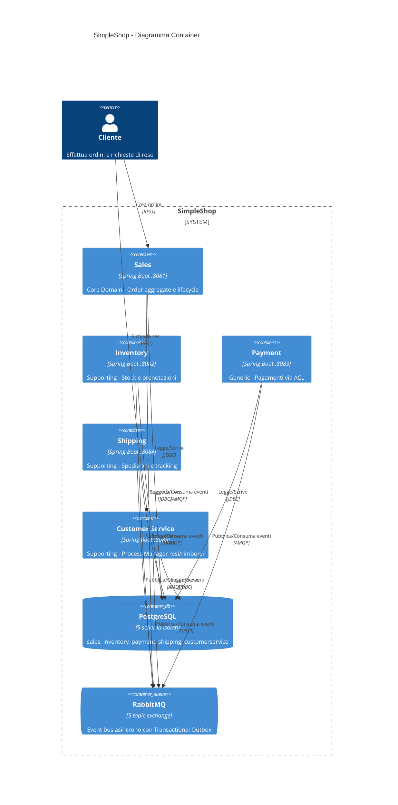

# SimpleShop - Sistema Distribuito Event-Driven con DDD

Proof of Technology di un sistema e-commerce distribuito che dimostra l'applicazione di Domain-Driven Design (DDD), architettura a microservizi, comunicazione asincrona tramite RabbitMQ e pattern Saga/Process Manager.

Ho scritto questa applicazione per studiare il DDD e pattern di resilienza e monitoraggio. Usala a tuo rischio.

Applicazione sviluppata con claude code e pensata come cookbook per lo sviluppo agentico enterprise.

## Architettura

**Pattern utilizzati:**
- **Transactional Outbox** — Eventi salvati nella stessa transazione dell'aggregato, pubblicati da poller asincrono
- **Saga Coreografata** — Order Fulfillment orchestrato tramite eventi tra i Bounded Context
- **Process Manager** — Return/Refund gestito da ReturnRequest aggregate in Customer Service
- **Anti-Corruption Layer** — Payment isola il dominio dal gateway di pagamento esterno

### Order Fulfillment Saga

## Disclaimer

Non adottare microservizi per moda, ma solo quando i driver di business (scalabilità, deploy indipendente, team autonomi) lo giustificano. Il modular monolith è spesso un'alternativa valida che offre molti dei benefici di manutenibilità senza la complessità distribuita.

DDD introduce complessità architetturale significativa, richiede una curva di apprendimento ripida per tutto il team, collaborazione continua con domain experts e può risultare un over-engineering costoso. Se applicato a domini semplici o con team inesperti meglio partire con approcci più semplici ([Transaction Script](https://martinfowler.com/eaaCatalog/transactionScript.html) o [Active Record](https://en.wikipedia.org/wiki/Active_record_pattern)) e adottare DDD solo quando la complessità del business lo giustifica realmente.

Se vuoi comunque utilizzare DDD e microservizi event-driven, continua a leggere.

## Libri consigliati

- Inizia con [Domain-Driven Design](https://amzn.to/4qsLoZ4).
- Prosegui con [Software Architecture: The Hard Parts](https://amzn.to/3MtgfXw) per i pattern Saga e workflow distribuiti
- Approfondisci con [Enterprise Integration Patterns](https://amzn.to/4rMGR52) per i dettagli di messaging e Process Manager
- Completa con [Designing Data-Intensive Applications](https://amzn.to/4qsKiws) per la teoria dei sistemi distribuiti
- Consulta [Release It!](https://amzn.to/3MhDmo6) per i pattern di resilienza in produzione

# Sviluppo MVP

## Backend

## Frontend

## Test end to end

# Requisiti non funzionali

## Prestazioni e Scalabilità

Tempi di risposta, throughput e ottimizzazione delle performance, horizontal scaling, auto-scaling e load balancing

## Affidabilità

Resilienza, fault tolerance e disaster recovery

## Sicurezza

Principi di sicurezza, validazione e protezione dei dati

## Monitoraggio

Logging, metriche, alerting e osservabilità
